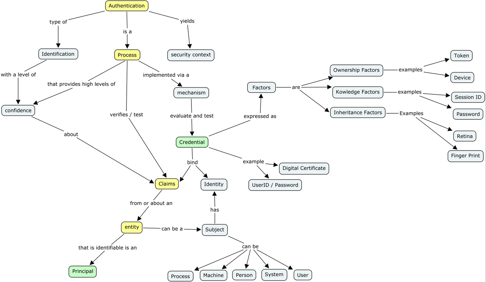
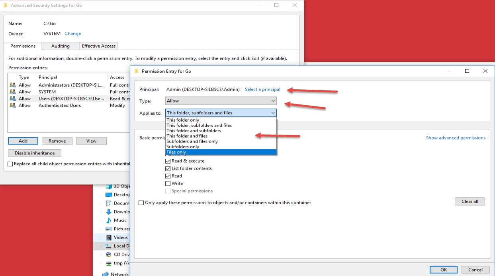

tags: [AuthNZ]($17072)

# Study existing AuthNZ concepts

/*
 * Copyright (c) 2024-present unTill Software Development Group B. V. 
 * @author Maxim Geraskin
 */

## [Stackoverflow](https://stackoverflow.com/questions/4989063/what-is-the-meaning-and-difference-between-subject-user-and-principal): What is the meaning and difference between subject, user and principal?
T.Rob:

- **Subject**:
  - In a security context, a subject is any entity that requests access to an object
  - These are generic terms used to denote the thing requesting access and the thing the request is made against
  - When you log onto an application you are the subject and the application is the object
  - When someone knocks on your door the visitor is the subject requesting access and your home is the object access is requested of.
  - In a sentence the subject is the actor and the object is the thing acted on
  - In a security context, a subject is anything that can make a request
- **Principal** 
  - A subset of subject that is represented by an account, role or other unique identifier. 
  - When we get to the level of implementation details, principals are the unique keys we use in access control lists. 
  - They may represent human users, automation, applications, connections, etc.
  - Principals are what subjects resolve to. When you present your credit card you are the subject and the account number is the principal.
- **User**: A subset of principal usually referring to a human operator. The distinction is blurring over time because the words "user" or "user ID" are commonly interchanged with "account". However, when you need to make the distinction between the broad class of things that are principals and the subset of these that are interactive operators driving transactions in a non%-deterministic fashion, "user" is the right word.





## [Oracle](https://docs.oracle.com/javase/7/docs/technotes/guides/security/jgss/tutorials/glossary.html): Subjects, Principals, Authentication, and Credentials

To authorize access to resources, applications first need to authenticate the source of the request. 

**Subject** represents the source of a request. A subject may be any entity, such as a person/device/service.

**Authentication** represents the process by which the identity of a subject is verified and typically involves the subject demonstrating some form of evidence to prove its identity. Such evidence may be information only the subject would likely know or have (such as a password or fingerprint), or it may be information only the subject could produce (such as signed data using a private key).

A Subject may have many **Principals**. For example, a person may have a name Principal ("John Doe") and an SSN Principal ("123-45-6789"), which distinguish it from other Subjects.

In addition to associated Principals, a Subject may own security-related attributes, which are referred to as **credentials**. A credential may contain information used to authenticate the subject to new services. Such credentials include passwords, Kerberos tickets, and public key certificates.

## [confluent, kafka](https://docs.confluent.io/platform/current/kafka/authorization.html): Authorization using ACLs

- An **authorizer** is a server plugin used by Apache Kafka® to authorize operations
- More specifically, an authorizer controls whether or not to authorize an operation based on the principal and the resource being accessed.
- A **principal** is an entity that can be authenticated by the authorizer. 
- The AclAuthorizer only supports individual users and always interprets the principal as the user name. However, other authorizers support groups
- Therefore, when specifying the principal you must include the type using the prefix `User:` or` Group:` (case-sensitive). Some examples: `User:admin, Group:developers`, or `User:CN=quickstart.confluent.io,OU=TEST,O=Sales,L=PaloAlto,ST=Ca,C=US`.
- **Wildcard principals**: You can create ACLs for all principals using a wildcard in the principal: `User:*`
- If you use an authorizer that supports group principals, such as Confluent Server Authorizer, you can also create ACLs for all group principals using the principal `Group:*`. ACLs that use the wildcard as the principal are applied to all users who belong to at least one group.

[Operations](https://docs.confluent.io/platform/current/kafka/authorization.html#operations)

Operations available for the Topic resource type:

| Operation       | Resource | APIs Allowed                                                             |
|-----------------|----------|--------------------------------------------------------------------------|
| Alter           | Topic    | CreatePartitions                                                         |
| AlterConfigs    | Topic    | AlterConfigs                                                             |
| Create          | Topic    | CreateTopics, Metadata                                                   |
| Delete          | Topic    | DeleteRecords, DeleteTopics                                              |
| Describe        | Topic    | ListOffsets, Metadata, OffsetFetch, OffsetForLeaderEpoch                 |
| DescribeConfigs | Topic    | DescribeConfigs                                                          |
| Read            | Topic    | Fetch, OffsetCommit, TxnOffsetCommit                                     |
| Write           | Topic    | Produce, AddPartitionsToTxn                                              |


Operations available for the Group resource type:

| Operation | Resource | APIs Allowed                                                                 |
|-----------|----------|------------------------------------------------------------------------------|
| Delete    | Group    | DeleteGroups                                                                 |
| Describe  | Group    | DescribeGroup, FindCoordinator, ListGroups                                   |
| Read      | Group    | AddOffsetsToTxn, Heartbeat, JoinGroup, LeaveGroup, OffsetCommit, OffsetFetch, SyncGroup, TxnOffsetCommit |


- When granted READ, WRITE, or DELETE, users implicitly derive the DESCRIBE operation
- When granted ALTER_CONFIGS, users implicitly derive the DESCRIBE_CONFIGS operation

```bash
bin/kafka-acls --bootstrap-server localhost:9092 --command-config adminclient-configs.conf --add \
 --allow-principal "User:CN=Bob Thomas,OU=Sales,O=Unknown,L=Unknown,ST=NY,C=Unknown" \
 --allow-principal "User:CN=Jane Smith,OU=Sales,O=Unknown,L=Unknown,ST=Unknown,C=Unknown" \
 --allow-host 198.51.100.0 --allow-host 198.51.100.1 \
 --operation Read --operation Write --topic test-topic
...
bin/kafka-acls --bootstrap-server localhost:9092 --command-config adminclient-configs.conf --add \
 --allow-principal User:'*' --allow-host '*' --deny-principal User:kafka/kafka6.host-1.com@bigdata.com --deny-host 198.51.100.3 \
 --operation Read --topic test-topic
```

-  Kafka ACLs are defined in the general format of “Principal P is [Allowed/Denied] Operation O From Host H On Resources matching ResourcePattern RP”.

## MS SQL
- [syslogins](https://docs.microsoft.com/en-us/sql/relational-databases/system-compatibility-views/sys-syslogins-transact-sql)
  - The syslogins table contains information on every login that has the potential to access the SQL Server in question ([link](https://www.mssqltips.com/sqlservertip/2026/tables-and-views-for-auditing-sql-server-logins/))
  - Having a login does not mean you have access to a database or having a user does not mean that you can connect to SQL or have access to the database ([link](https://www.sqlservercentral.com/forums/topic/relation-between-sysusers-and-syslogins))
- syslogins is deprecated and it is a view for backward compatibility
- [sys.server_principals](https://docs.microsoft.com/en-us/sql/relational-databases/system-catalog-views/sys-server-principals-transact-sq) is used:
  - S = SQL login
  - U = Windows login
  - G = Windows group
  - R = Server role
  - C = Login mapped to a certificate
  - E = External Login from Azure Active Directory
  - X = External group from Azure Active Directory group or applications
  - K = Login mapped to an asymmetric key

## Heeus
- “Principal P is %[Allowed/Denied%] Operation O From Host H On Resources matching ResourcePattern RP”.
  - Principal
  - Policy (Allow/Deny)
  - Operation
  - %[%]Host
  - ResourcePattern
  - MembershipInheritance (00, 10, 11, 01)

Example

- Project1: {ID:600, Type: Project, Membership: %[{Peter: Manager}%]}
  - Project1%_1: {ID: 678, Type: Project}

Manager should be able to delete subprojects only

|Principal|Policy|Operation|Resource|MembershipInheritance
|PM|Allow |Edit|Project.is%_active|01
|PM|Allow |Edit|Project.descr |11
principal%+operation%+resource authorization pseudocode:

- Build accumulated (???) and memberships{Parent, Member}
  - Including implicit membership
- Build accumulated ACLs
- policy = false
- for ACL in ACLs
  - Ignore ACL if membership.Parent = $ID AND ACL.Inheritance = 01
  - Ignore ACL if membership.Parent %!= $ID AND ACL.Inheritance = 10
  - Ignore if memberships%[ACL.Principal%] does not exist
  - Ignore if Resource does not match
  - Ignore if Operation does not match
  - policy = ACL.policy

## Windows 10


### Principal: субъект

**Add permissions**:


**Show advanced persmissions**:


### Default special identity groups

https://learn.microsoft.com/en-us/windows-server/identity/ad-ds/manage/understand-special-identities-groups

- Anonymous Logon
- Attested key property
- Authenticated Users
- Authentication authority asserted identity
- Batch
- Console logon
- Creator Group
- Creator Owner
- Dialup
- Digest Authentication
- Enterprise Domain Controllers
- Enterprise Read-only Domain Controllers
- Everyone
- Fresh Public Key identity
- Interactive
- IUSR
- Key trust
- Local Service
- LocalSystem
- MFA key property
- Network
- Network Service
- NTLM Authentication
- Other Organization
- Owner Rights
- Principal Self
- Proxy
- Read-only Domain Controllers
- Remote Interactive Logon
- Restricted
- SChannel Authentication
- Service
- Service asserted identity
- Terminal Server User
- This Organization
- Window Manager\Window Manager Group